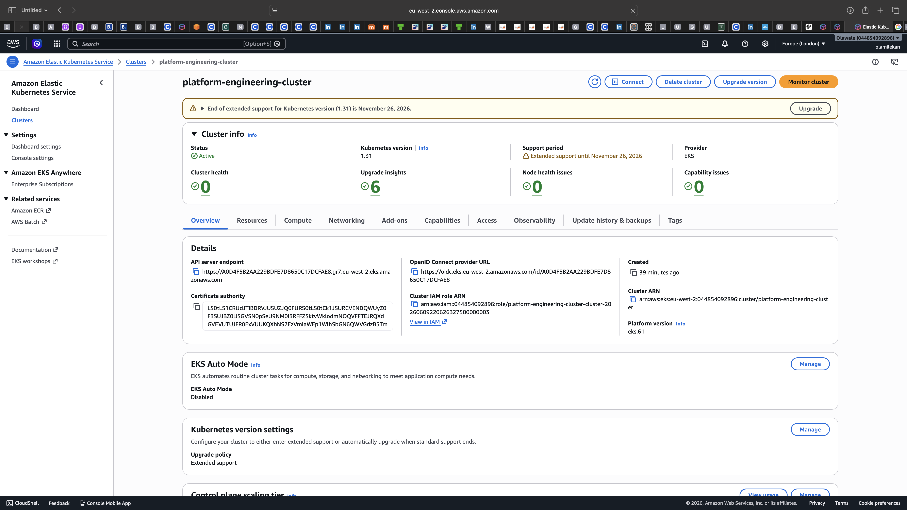
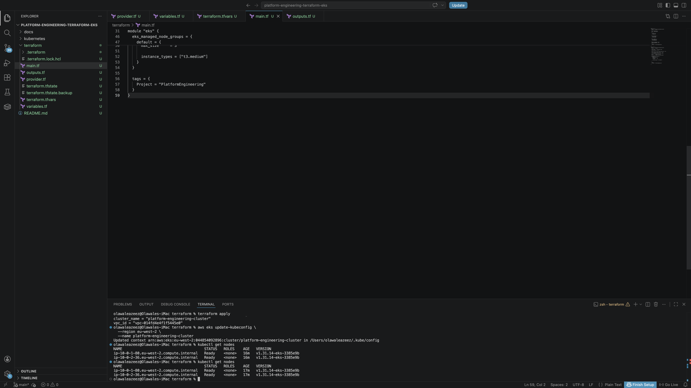
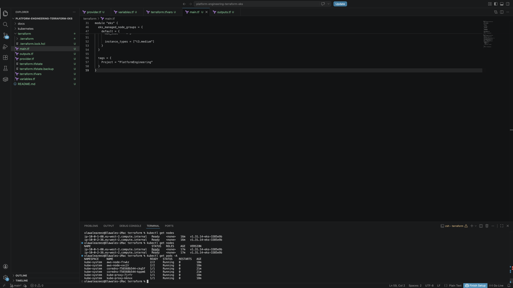
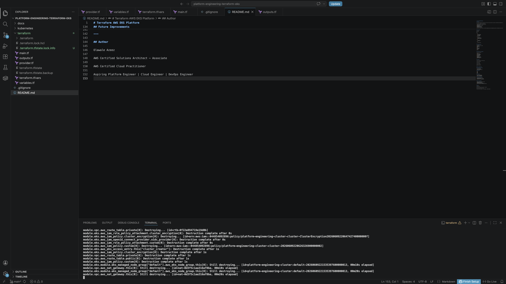

# Terraform AWS EKS Platform

## Overview

This project demonstrates Infrastructure as Code (IaC) using Terraform to provision a production-style Kubernetes platform on AWS.

The platform automates the deployment of:

* Amazon EKS (Elastic Kubernetes Service)
* VPC Networking
* Public and Private Subnets
* NAT Gateway
* IAM Roles and Policies
* Managed Node Groups
* Kubernetes Worker Nodes

The project was built as part of my Platform Engineering and Cloud Engineering portfolio to demonstrate cloud infrastructure automation, Kubernetes administration, and AWS platform deployment.

---

## Architecture

User/Admin
↓
Terraform
↓
AWS

* VPC

  * Public Subnets
  * Private Subnets
  * NAT Gateway
  * Route Tables

* Amazon EKS

  * Control Plane
  * Managed Node Group
  * EC2 Worker Nodes

* IAM

  * Cluster Roles
  * Node Roles

* KMS

  * Encryption Keys

---

## Technologies Used

* Terraform
* Amazon Web Services (AWS)
* Amazon EKS
* Amazon VPC
* IAM
* EC2
* NAT Gateway
* Kubernetes
* kubectl
* Git
* GitHub

---

## Infrastructure Provisioned

Terraform provisions:

* AWS VPC
* Public Subnets
* Private Subnets
* Internet Gateway
* NAT Gateway
* Route Tables
* Security Groups
* IAM Roles
* Amazon EKS Cluster
* Managed Node Group
* KMS Encryption

---

## Validation

Cluster connectivity verified using:

terraform validate

terraform plan

terraform apply

kubectl get nodes

kubectl get pods -A

---

## Skills Demonstrated

### Infrastructure as Code

* Terraform modules
* State management
* Reusable infrastructure

### AWS Cloud

* EKS
* VPC
* IAM
* EC2
* KMS

### Kubernetes

* Cluster provisioning
* Worker node management
* kubectl administration

### Platform Engineering

* Infrastructure automation
* Cloud networking
* Kubernetes platform deployment
* Infrastructure troubleshooting

---

## Future Improvements

* Deploy sample applications to EKS
* Implement Helm charts
* Add GitHub Actions CI/CD
* Add Terraform remote state in S3
* Add monitoring with Prometheus and Grafana

## Screenshots

### Amazon EKS Cluster

### Kubernetes Worker Nodes

### Kubernetes System Pods

### Infrastructure Cleanup

---

## Author

Olawale Azeez

AWS Certified Solutions Architect – Associate

AWS Certified Cloud Practitioner

Aspiring Platform Engineer | Cloud Engineer | DevOps Engineer
