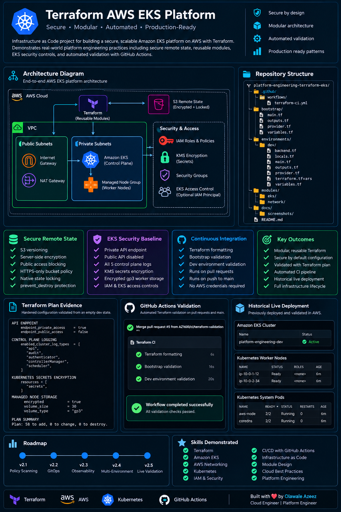
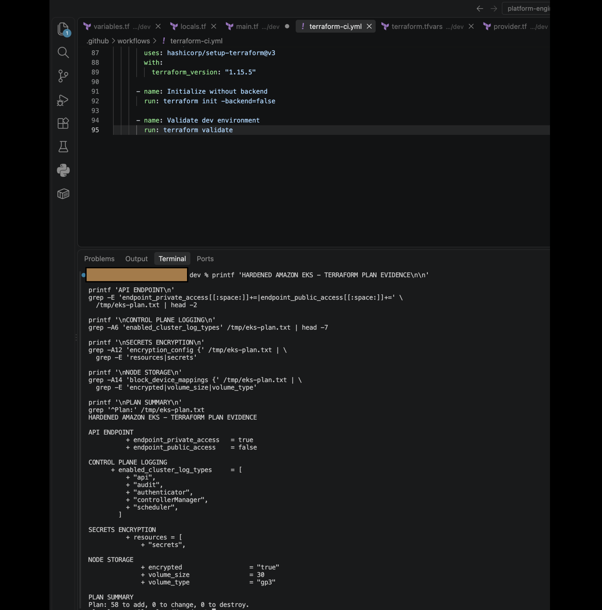
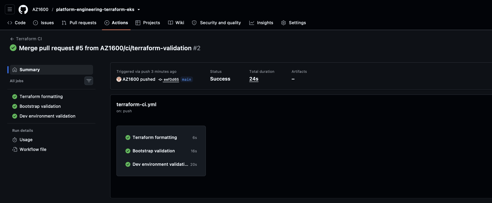
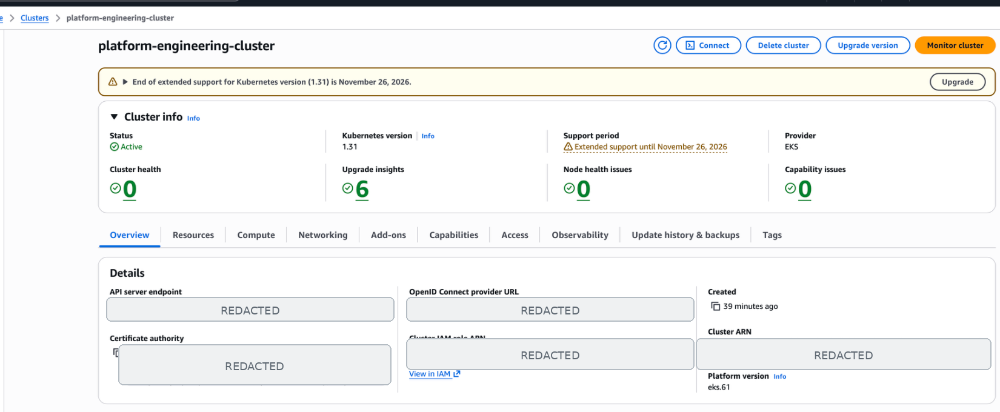
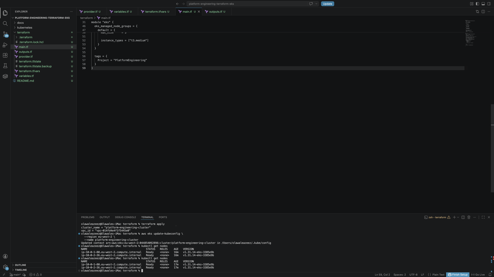
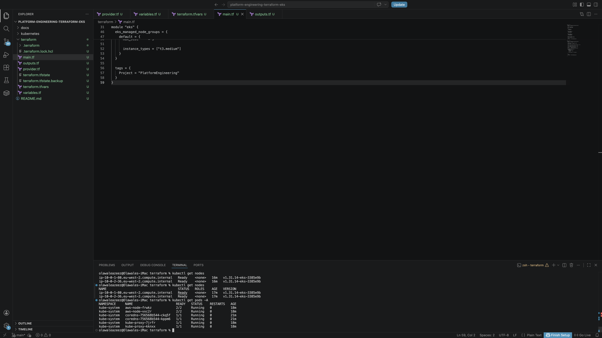
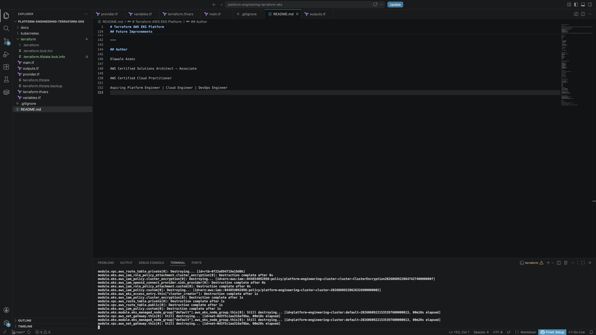

# Terraform AWS EKS Platform

Infrastructure as Code project for building a secure Amazon EKS platform on AWS with Terraform.

The repository demonstrates reusable Terraform modules, environment-based configuration, secure remote state, EKS security controls, managed worker nodes, and automated Terraform validation with GitHub Actions.

The current hardened configuration has been validated with Terraform plan and CI. Historical screenshots from an earlier live deployment are retained as evidence of cluster provisioning, Kubernetes connectivity, and infrastructure teardown.

---

## Project Overview



---

## Architecture

```text
Developer / Platform Engineer
            |
            v
        Terraform
            |
            +-----------------------------+
            |                             |
            v                             v
   Secure S3 Remote State            AWS Platform
                                          |
                             +------------+------------+
                             |                         |
                             v                         v
                           VPC                    Amazon EKS
                             |                         |
                 +-----------+----------+              |
                 |                      |              |
                 v                      v              |
          Public Subnets         Private Subnets      |
                 |                      |              |
          Internet Gateway          NAT Gateway       |
                                                    |
                                      +-------------+-------------+
                                      |                           |
                                      v                           v
                              Private API Endpoint       Managed Node Group
                                      |                           |
                              Control Plane Logs            Encrypted gp3
                                      |                      Worker Storage
                                      v
                               KMS Encryption
                               for K8s Secrets
```

---

## Repository Structure

```text
.
├── .github/
│   └── workflows/
│       └── terraform-ci.yml
│
├── bootstrap/
│   ├── main.tf
│   ├── outputs.tf
│   ├── provider.tf
│   └── variables.tf
│
├── environments/
│   └── dev/
│       ├── backend.tf
│       ├── locals.tf
│       ├── main.tf
│       ├── outputs.tf
│       ├── provider.tf
│       ├── terraform.tfvars
│       └── variables.tf
│
├── modules/
│   ├── eks/
│   │   ├── main.tf
│   │   ├── outputs.tf
│   │   └── variables.tf
│   │
│   └── network/
│       ├── main.tf
│       ├── outputs.tf
│       └── variables.tf
│
├── docs/
│   └── screenshots/
│
└── README.md
```

---

## Platform Components

The Terraform configuration defines:

- Amazon VPC
- public and private subnets
- Internet Gateway
- NAT Gateway
- route tables
- Amazon EKS
- EKS managed node groups
- IAM roles and policies
- security groups
- KMS-backed Kubernetes secrets encryption
- encrypted worker node storage
- secure Terraform remote state

Reusable infrastructure is separated into `network` and `eks` modules, while environment-specific configuration is maintained under `environments/dev`.

---

## Secure Remote State

Terraform state is stored in a dedicated Amazon S3 backend created through the `bootstrap` configuration.

The state foundation includes:

- S3 versioning
- server-side encryption
- public access blocking
- HTTPS-only bucket policy
- native S3 Terraform state locking
- `prevent_destroy` protection on the state bucket
- separate state keys for bootstrap and EKS environment state

This keeps state management separate from the application infrastructure and provides a stronger baseline for team-oriented Terraform workflows.

---

## EKS Security Baseline

The EKS module includes explicit security controls rather than relying only on defaults.

### Private EKS API

The dev baseline uses:

```hcl
cluster_endpoint_private_access = true
cluster_endpoint_public_access  = false
```

Public API access can be enabled through configuration when required rather than remaining permanently exposed.

### Control Plane Logging

All five Amazon EKS control plane log types are enabled:

```text
api
audit
authenticator
controllerManager
scheduler
```

### Kubernetes Secrets Encryption

Kubernetes secrets are explicitly configured for encryption through the EKS encryption configuration.

### Cluster Access

Cluster creator administrator permissions are configurable.

The module also supports an optional explicit IAM principal through an Amazon EKS access entry using:

```text
AmazonEKSClusterAdminPolicy
```

### Managed Node Storage

Managed worker nodes use:

```text
Encrypted: true
Volume type: gp3
Volume size: 30 GiB
```

Disk sizing remains configurable through Terraform variables.

---

## Hardened Terraform Plan Evidence

The current dev environment state is empty, so the hardened configuration was validated as a full infrastructure creation plan.

The plan verified:

- private EKS API access enabled
- public EKS API access disabled
- all five EKS control plane log types enabled
- Kubernetes secrets encryption configured
- encrypted worker storage enabled
- `gp3` worker volumes
- no destructive actions

Plan result:

```text
Plan: 58 to add, 0 to change, 0 to destroy.
```



No infrastructure was applied from this saved validation plan.

---

## Continuous Integration

GitHub Actions automatically validates Terraform changes on pull requests and pushes to `main`.

The workflow contains three validation jobs:

```text
Terraform formatting
Bootstrap validation
Dev environment validation
```

Terraform is initialized in CI with:

```bash
terraform init -backend=false
```

This allows Terraform configuration validation without requiring AWS credentials or access to the remote state bucket.

### Terraform CI Validation



---

## Historical Live Deployment Evidence

The repository also contains screenshots from an earlier live Amazon EKS deployment.

These screenshots demonstrate previous successful infrastructure provisioning and Kubernetes connectivity.

They are retained as historical deployment evidence and are not presented as proof that the current hardened configuration is presently running.

### Amazon EKS Cluster



### Kubernetes Worker Nodes



### Kubernetes System Pods



---

## Infrastructure Lifecycle

The earlier live environment was destroyed after validation to avoid leaving unnecessary cloud resources running.



The project demonstrates the full Terraform lifecycle:

```text
Initialize
    |
    v
Validate
    |
    v
Plan
    |
    v
Provision
    |
    v
Verify
    |
    v
Destroy
```

---

## Local Validation

### Format

```bash
terraform fmt -check -recursive
```

### Validate Bootstrap

```bash
cd bootstrap
terraform init -backend=false
terraform validate
```

### Validate Dev Environment

```bash
cd environments/dev
terraform init -backend=false
terraform validate
```

### Create a Remote-State Plan

Authenticate with the appropriate AWS profile and initialize the configured backend before creating a real plan.

Example:

```bash
export AWS_PROFILE=<your-profile>
export TF_STATE_BUCKET=<your-state-bucket>

cd environments/dev

terraform init -reconfigure \
  -backend-config="bucket=$TF_STATE_BUCKET"

terraform plan
```

Do not commit AWS credentials, access keys, session tokens, or local Terraform state files to the repository.

---

## Technologies

- Terraform
- Amazon Web Services
- Amazon EKS
- Amazon VPC
- Amazon EC2
- AWS IAM
- AWS KMS
- Amazon S3
- Kubernetes
- GitHub Actions
- Git
- kubectl

---

## Skills Demonstrated

### Infrastructure as Code

- reusable Terraform modules
- environment-based configuration
- remote state architecture
- Terraform lifecycle management
- provider and module version pinning

### AWS Platform Engineering

- Amazon EKS
- VPC networking
- IAM access management
- KMS encryption
- managed worker nodes
- private control plane access

### Security

- private EKS API baseline
- Kubernetes secrets encryption
- encrypted worker storage
- least-exposure configuration
- secure state bucket controls
- explicit administrator access configuration

### CI/CD

- GitHub Actions
- Terraform formatting checks
- automated configuration validation
- backend-independent CI validation

### Operational Practice

- plan-first infrastructure changes
- validation before merge
- evidence-based documentation
- infrastructure teardown after testing
- cost-aware cloud resource lifecycle management

---

## Engineering Roadmap

Potential future improvements include:

- TFLint integration
- IaC security scanning
- policy-as-code validation
- GitOps workload deployment
- Kubernetes NetworkPolicies
- observability integration
- additional environment configurations
- fresh live deployment validation of the hardened baseline

---

## Project Status

```text
Remote State Foundation        COMPLETE
Environment Structure          COMPLETE
Reusable Terraform Modules     COMPLETE
EKS Security Baseline          COMPLETE
Terraform CI Validation        COMPLETE
Plan Evidence                  COMPLETE
Historical Live Validation     COMPLETE
Fresh Hardened Live Deploy     FUTURE
```

---

## Author

**Olawale Azeez**

Cloud Engineer | Platform Engineer
AWS Certified Developer – Associate

AWS • Terraform • Kubernetes • Platform Engineering • Cloud Infrastructure • DevOps