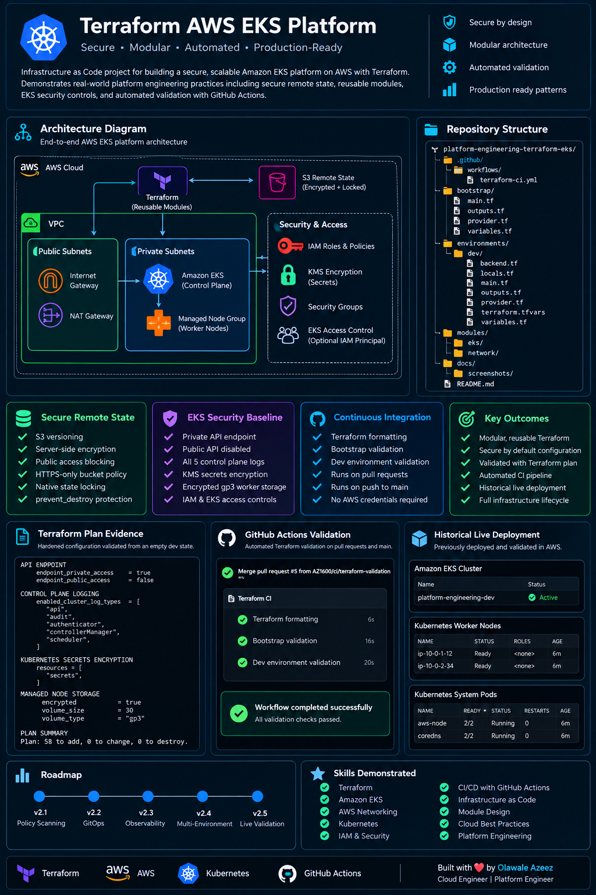
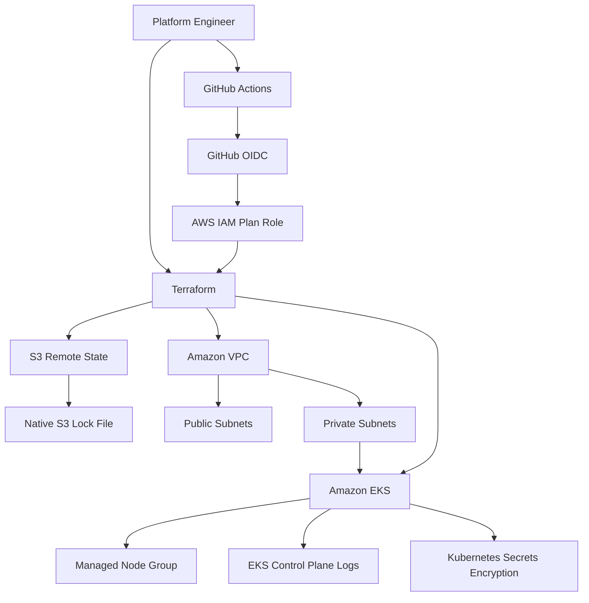
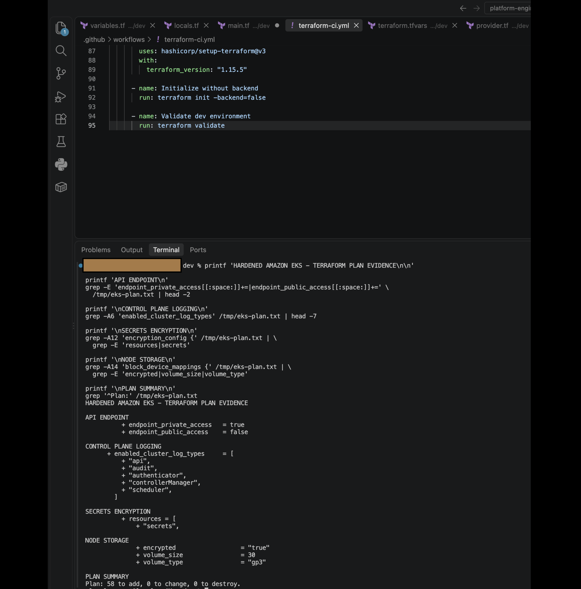
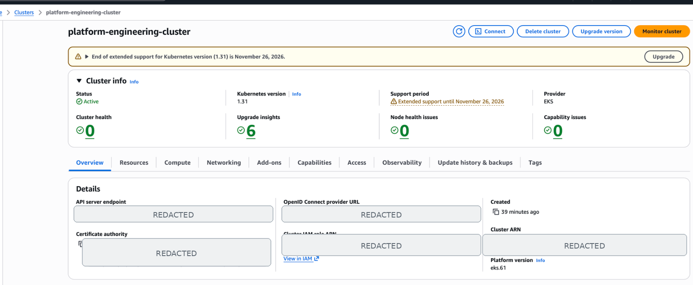
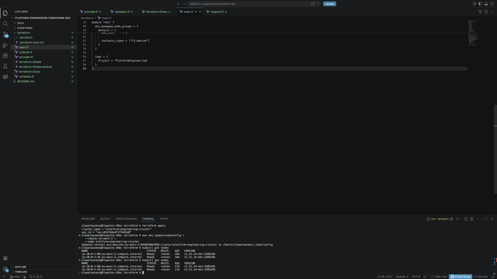
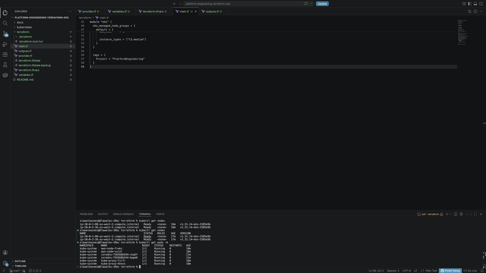
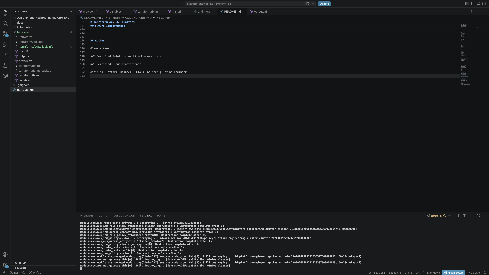

# Terraform AWS EKS Platform

[](https://github.com/AZ1600/platform-engineering-terraform-eks/actions/workflows/terraform-ci.yml)
[](https://github.com/AZ1600/platform-engineering-terraform-eks/actions/workflows/terraform-security.yml)
[](https://github.com/AZ1600/platform-engineering-terraform-eks/actions/workflows/terraform-plan.yml)

A security-focused Infrastructure as Code project for building and validating an Amazon EKS platform on AWS with Terraform.

The repository demonstrates reusable Terraform modules, environment-based configuration, secure remote-state design, private EKS networking, managed worker nodes, native Terraform tests, static analysis, IaC security scanning, GitHub Actions CI, and a real AWS-backed **plan-only workflow using GitHub OIDC**.

The platform is deliberately designed so infrastructure can be validated without leaving an EKS cluster running continuously and generating unnecessary cloud cost.

---

# Project Overview



---

# What This Project Demonstrates

The repository includes:

- reusable Terraform modules
- environment-specific configuration
- Amazon VPC networking
- public and private subnets
- multi-AZ topology
- Amazon EKS
- EKS managed node groups
- private EKS API access by default
- EKS control plane logging
- Kubernetes secrets encryption
- encrypted `gp3` worker storage
- EKS access entries
- secure Terraform remote-state architecture
- S3 state locking
- provider dependency lock files
- Terraform variable guardrails
- native `terraform test` suites
- TFLint static analysis
- Trivy IaC security scanning
- GitHub Actions configuration validation
- GitHub Actions OIDC authentication
- short-lived AWS credentials
- plan-only AWS validation
- no CI-based Terraform apply
- cost-aware infrastructure lifecycle management
- historical live EKS deployment evidence
- engineering troubleshooting documentation

---

# Architecture


```mermaid
flowchart TB
    Developer["Platform Engineer"]

    GitHub["GitHub Actions"]
    OIDC["GitHub OIDC"]
    IAM["AWS IAM Plan Role"]

    Terraform["Terraform"]

    State["S3 Remote State"]
    Lock["Native S3 Lock File"]

    VPC["Amazon VPC"]
    Public["Public Subnets"]
    Private["Private Subnets"]
    EKS["Amazon EKS"]
    Nodes["Managed Node Group"]
    Logs["EKS Control Plane Logs"]
    Encryption["Kubernetes Secrets Encryption"]

    Developer --> Terraform
    Developer --> GitHub

    GitHub --> OIDC
    OIDC --> IAM
    IAM --> Terraform

    Terraform --> State
    State --> Lock

    Terraform --> VPC
    Terraform --> EKS

    VPC --> Public
    VPC --> Private

    Private --> EKS
    EKS --> Nodes
    EKS --> Logs
    EKS --> Encryption
```

---

# Repository Structure

```text
.
├── .github/
│   └── workflows/
│       ├── terraform-ci.yml
│       ├── terraform-plan.yml
│       └── terraform-security.yml
│
├── .gitignore
├── .tflint.hcl
│
├── bootstrap/
│   ├── .terraform.lock.hcl
│   ├── main.tf
│   ├── outputs.tf
│   ├── provider.tf
│   └── variables.tf
│
├── docs/
│   ├── screenshots/
│   └── troubleshooting.md
│
├── environments/
│   └── dev/
│       ├── .terraform.lock.hcl
│       ├── backend.tf
│       ├── locals.tf
│       ├── main.tf
│       ├── outputs.tf
│       ├── provider.tf
│       ├── terraform.tfvars
│       └── variables.tf
│
├── modules/
│   ├── eks/
│   │   ├── main.tf
│   │   ├── outputs.tf
│   │   ├── variables.tf
│   │   ├── versions.tf
│   │   └── tests/
│   │       └── guardrails.tftest.hcl
│   │
│   └── network/
│       ├── main.tf
│       ├── outputs.tf
│       ├── variables.tf
│       ├── versions.tf
│       └── tests/
│           └── guardrails.tftest.hcl
│
└── README.md
```

---

# Platform Components

The Terraform configuration defines:

```text
Amazon VPC
Public Subnets
Private Subnets
Internet Gateway
NAT Gateway
Route Tables
Amazon EKS
EKS Managed Node Groups
IAM Roles and Policies
Security Groups
Kubernetes Secrets Encryption
Encrypted Worker Storage
Terraform Remote State
```

Reusable infrastructure is split into:

```text
modules/network
modules/eks
```

Environment-specific configuration is maintained under:

```text
environments/dev
```

---

# Network Architecture

The network module uses the community VPC module and creates a multi-AZ VPC.

The dev environment currently uses:

```text
VPC CIDR: 10.0.0.0/16

Availability Zones:
eu-west-2a
eu-west-2b

Private Subnets:
10.0.1.0/24
10.0.2.0/24

Public Subnets:
10.0.101.0/24
10.0.102.0/24
```

The module requires at least two availability zones and validates subnet topology before Terraform reaches AWS.

---

# EKS Security Baseline

The EKS module includes explicit security controls rather than relying only on service defaults.

## Private EKS API

The dev environment uses:

```hcl
cluster_endpoint_private_access = true
cluster_endpoint_public_access  = false
```

The public endpoint can be enabled explicitly when required, but guardrails prevent unrestricted exposure.

If public endpoint access is enabled, the module requires restricted CIDRs and rejects:

```text
0.0.0.0/0
::/0
```

---

# EKS Control Plane Logging

All five supported Amazon EKS control plane log types are enabled by default:

```text
api
audit
authenticator
controllerManager
scheduler
```

Terraform validation also rejects unsupported control plane log types.

---

# Kubernetes Secrets Encryption

The EKS module explicitly configures Kubernetes secrets encryption:

```hcl
cluster_encryption_config = {
  resources = ["secrets"]
}
```

This ensures Kubernetes secrets are covered by EKS encryption configuration rather than relying only on default storage behavior.

---

# EKS Cluster Access

Cluster creator administrator permissions are configurable.

The module also supports an optional explicit administrator principal through an Amazon EKS access entry.

The access policy used is:

```text
AmazonEKSClusterAdminPolicy
```

This demonstrates modern EKS access management rather than relying solely on legacy `aws-auth` configuration.

---

# Managed Node Groups

The dev environment uses an EKS managed node group.

Current baseline:

```text
Instance type: t3.medium

Desired nodes: 2
Minimum nodes: 2
Maximum nodes: 3

Root volume:
30 GiB
gp3
encrypted
```

The worker nodes also receive labels:

```text
environment = dev
workload    = platform
```

---

# Worker Storage Security

Managed node root volumes are explicitly configured as:

```text
Encrypted: true
Volume type: gp3
Delete on termination: true
```

The disk size remains configurable through Terraform.

A variable guardrail ensures worker root disks cannot be configured below the project minimum.

---

# Secure Remote State

Terraform uses an Amazon S3 backend.

The backend architecture is separated from the EKS environment through:

```text
bootstrap/
```

The bootstrap configuration defines:

- S3 state storage
- versioning
- public-access blocking
- HTTPS-only access policy
- server-side encryption
- native S3 Terraform locking
- `prevent_destroy`
- separate Terraform state keys

State paths include:

```text
bootstrap/terraform.tfstate
eks/dev/terraform.tfstate
```

The dev backend uses:

```hcl
use_lockfile = true
```

which provides native S3 state locking without requiring a DynamoDB lock table.

---

# Remote-State Encryption Note

The **current bootstrap Terraform configuration** defines customer-managed KMS encryption for newly managed state infrastructure.

During OIDC workflow validation, the existing remote-state bucket used by the project was inspected and found to currently use:

```text
SSE-S3
AES256
```

rather than the KMS-backed configuration now defined in `bootstrap/`.

This is documented intentionally as a historical infrastructure difference rather than being hidden.

The current IaC baseline represents the stronger target configuration.

A future state-foundation migration or rebuild can bring the live state bucket into alignment with the current KMS-backed bootstrap design.

See:

```text
docs/troubleshooting.md
```

for the investigation details.

---

# Terraform Provider Reproducibility

Terraform root configurations commit dependency lock files:

```text
bootstrap/.terraform.lock.hcl
environments/dev/.terraform.lock.hcl
```

These capture provider versions and integrity hashes.

Reusable modules instead declare provider requirements in:

```text
modules/eks/versions.tf
modules/network/versions.tf
```

Example:

```hcl
terraform {
  required_version = ">= 1.10"

  required_providers {
    aws = {
      source  = "hashicorp/aws"
      version = ">= 5.79.0, < 6.0"
    }
  }
}
```

Module-local lock files generated during direct module testing are ignored.

---

# Terraform Guardrails

The reusable modules enforce architectural and security invariants before configuration reaches AWS.

This moves important safety checks closer to the module boundary.

---

# EKS Guardrails

The EKS module rejects:

```text
Public EKS API access without restricted CIDRs
0.0.0.0/0 public endpoint exposure
::/0 public endpoint exposure
Desired node count below minimum
Desired node count above maximum
Negative minimum node count
Empty node instance type list
Invalid EKS control plane log types
```

It also validates worker disk sizing.

---

# Network Guardrails

The network module rejects:

```text
Single availability zone topology
Duplicate availability zones
Private subnet count mismatch
Public subnet count mismatch
Invalid VPC CIDR
Invalid subnet CIDRs
Duplicate subnet CIDRs
```

This protects the reusable VPC module from structurally invalid input.

---

# Native Terraform Tests

The project uses the native Terraform test framework:

```bash
terraform test
```

Tests are stored in:

```text
modules/eks/tests/guardrails.tftest.hcl
modules/network/tests/guardrails.tftest.hcl
```

The tests use:

```hcl
mock_provider "aws" {}
```

and module overrides so they can validate module contracts without calling real AWS APIs.

---

# EKS Test Suite

Current result:

```text
Success! 8 passed, 0 failed.
```

The EKS suite verifies:

- public endpoint requires restricted CIDRs
- unrestricted IPv4 access is rejected
- unrestricted IPv6 access is rejected
- desired node count cannot fall below minimum
- desired node count cannot exceed maximum
- negative minimum node count is rejected
- empty instance-type configuration is rejected
- invalid control-plane log types are rejected

---

# Network Test Suite

Current result:

```text
Success! 7 passed, 0 failed.
```

The network suite verifies:

- at least two availability zones
- duplicate AZs are rejected
- private subnet count matches AZ count
- public subnet count matches AZ count
- invalid VPC CIDRs are rejected
- invalid private subnet CIDRs are rejected
- duplicate public subnet CIDRs are rejected

---

# Continuous Integration

The repository uses multiple GitHub Actions workflows with different responsibilities.

```text
Terraform CI
Terraform Security
Terraform AWS Plan
```

This separates syntax/configuration validation, security analysis, and AWS-backed planning into independent controls.

---

# Terraform CI

Workflow:

```text
.github/workflows/terraform-ci.yml
```

Runs on pull requests and pushes to `main`.

It performs:

```text
Terraform formatting
Bootstrap initialization
Bootstrap validation
Dev environment initialization
Dev environment validation
EKS module tests
Network module tests
```

The normal CI jobs use:

```bash
terraform init -backend=false
```

where appropriate so configuration can be validated without AWS credentials or access to the live state bucket.

---

# Terraform Security Pipeline

Workflow:

```text
.github/workflows/terraform-security.yml
```

The security workflow runs:

```text
TFLint
Trivy IaC scanning
```

---

# TFLint

TFLint performs Terraform static analysis.

Configuration:

```text
.tflint.hcl
```

The AWS ruleset is enabled so the project receives Terraform- and AWS-specific linting rather than basic syntax checks only.

CI command:

```bash
tflint \
  --recursive \
  --call-module-type=local \
  --format=compact
```

---

# Trivy IaC Security Scanning

Trivy scans Terraform configuration for security issues.

CI is configured to fail on:

```text
HIGH
CRITICAL
```

severity findings.

The scan excludes downloaded Terraform modules so the repository is judged primarily on infrastructure code maintained directly in this project.

Example:

```bash
trivy config \
  --tf-exclude-downloaded-modules \
  --skip-dirs '**/.terraform' \
  --severity HIGH,CRITICAL \
  --exit-code 1 \
  .
```

---

# GitHub OIDC Authentication

The repository uses GitHub Actions OpenID Connect federation for AWS authentication.

No long-lived AWS access keys are required in GitHub.

The authentication path is:

```text
GitHub Actions
      |
      v
GitHub OIDC Token
      |
      v
AWS STS AssumeRoleWithWebIdentity
      |
      v
GitHubTerraformPlanRole
      |
      v
Temporary AWS Credentials
```

The workflow requests:

```yaml
permissions:
  contents: read
  id-token: write
```

AWS credentials are configured using:

```text
aws-actions/configure-aws-credentials
```

---

# OIDC Trust Restriction

The IAM trust relationship is scoped to this repository and the `main` branch.

The expected subject is:

```text
repo:AZ1600/platform-engineering-terraform-eks:ref:refs/heads/main
```

This prevents arbitrary GitHub repositories or feature branches from assuming the Terraform plan role.

---

# No Long-Lived AWS Keys in GitHub

The repository does not need GitHub secrets containing:

```text
AWS_ACCESS_KEY_ID
AWS_SECRET_ACCESS_KEY
AWS_SESSION_TOKEN
```

Instead, GitHub obtains short-lived credentials at runtime through OIDC federation.

Repository variables are used only for non-secret configuration such as:

```text
AWS_TERRAFORM_PLAN_ROLE_ARN
TF_STATE_BUCKET
```

---

# Plan-Only AWS Workflow

Workflow:

```text
.github/workflows/terraform-plan.yml
```

The workflow is deliberately separate from normal CI.

It is:

- manually triggered
- restricted to `main`
- protected by an explicit confirmation input
- authenticated with GitHub OIDC
- backed by the real Terraform S3 state
- capable of running a real Terraform plan
- unable to automatically deploy from the workflow

There is intentionally **no `terraform apply` step**.

---

# Plan Workflow Controls

The plan workflow includes:

```text
workflow_dispatch only
Explicit confirmation
main branch restriction
OIDC authentication
AWS identity verification
Remote-state initialization
terraform validate
terraform plan
Detailed exit-code handling
Plan summary
No plan artifact upload
Local plan-file cleanup
Concurrency protection
```

Terraform plans can contain infrastructure details, so the generated binary plan is not persisted as a GitHub artifact.

---

# Successful OIDC Plan Validation

The plan workflow has been successfully executed against AWS from `main`.

The validated path was:

```text
GitHub Actions
      |
      v
GitHub OIDC
      |
      v
AWS IAM Role
      |
      v
AWS STS Temporary Credentials
      |
      v
S3 Terraform State
      |
      v
terraform validate
      |
      v
terraform plan
      |
      v
Successful Workflow Completion
```

The successful workflow verified:

- GitHub could obtain an OIDC token
- AWS accepted the repository trust relationship
- the IAM role could be assumed
- AWS identity verification succeeded
- Terraform could initialize the live S3 backend
- state-lock permissions worked
- Terraform validation succeeded
- Terraform planning succeeded
- the plan file was removed afterwards
- no Terraform apply occurred

This provides real AWS-backed CI evidence without requiring a permanent EKS environment.

---

# AWS Plan IAM Model

The GitHub plan role uses a split permission model.

It receives AWS read access for infrastructure inspection and narrowly scoped write permissions required for Terraform state locking.

The state permissions are limited to the project state path and lock object.

Conceptually:

```text
AWS infrastructure
    |
    └── Read only

Terraform state object
    |
    └── Read

Terraform lock object
    |
    ├── Read
    ├── Create
    └── Delete
```

This allows Terraform to coordinate state safely without granting the workflow general infrastructure deployment permissions.

---

# Why There Is No Automatic Apply

The project intentionally separates:

```text
Validation
Planning
Deployment
```

The current CI/CD design proves that Terraform configuration can be validated and planned against AWS without automatically creating resources.

This is useful for:

- portfolio validation
- cost control
- change review
- least privilege
- reducing accidental infrastructure creation

A production deployment pipeline could later add a separately protected apply workflow using stricter approvals and deployment-specific permissions.

---

# Hardened Terraform Plan Evidence

The hardened dev environment has previously been validated as a full infrastructure creation plan.

The plan confirmed:

- private EKS API enabled
- public EKS API disabled
- all five EKS control plane log types enabled
- Kubernetes secrets encryption configured
- encrypted worker storage
- `gp3` worker volumes
- no destructive actions

Historical plan result:

```text
Plan: 58 to add, 0 to change, 0 to destroy.
```



No infrastructure was applied from that validation plan.

---

# Historical Live Deployment Evidence

The repository also retains evidence from an earlier successful Amazon EKS deployment.

The screenshots demonstrate that a previous version of the platform completed:

```text
Terraform apply
EKS provisioning
Worker-node registration
kubectl connectivity
System-pod validation
Infrastructure teardown
```

These screenshots are historical evidence and are not presented as proof that the current hardened baseline is continuously deployed.

---

# Amazon EKS Cluster Evidence



---

# Kubernetes Worker Nodes



---

# Kubernetes System Pods



---

# Infrastructure Teardown

The earlier live environment was destroyed after validation to avoid unnecessary cloud cost.



The demonstrated infrastructure lifecycle is:

```text
Initialize
    |
    v
Validate
    |
    v
Test
    |
    v
Security Scan
    |
    v
Plan
    |
    v
Provision
    |
    v
Verify
    |
    v
Destroy
```

---

# Cost-Aware Design

Amazon EKS, NAT Gateway, worker nodes, and related AWS services can generate ongoing charges.

This project therefore avoids requiring a permanently running environment for portfolio evidence.

The current model favors:

```text
Static validation
Native Terraform tests
Security scanning
AWS-backed plan validation
Historical live-deployment evidence
Infrastructure teardown
```

This demonstrates infrastructure engineering capability while avoiding unnecessary long-running resources.

---

# Local Validation

## Terraform Format

```bash
terraform fmt -check -recursive
```

---

# Validate Bootstrap

```bash
cd bootstrap

terraform init -backend=false
terraform validate
```

---

# Validate Dev Environment

```bash
cd environments/dev

terraform init -backend=false
terraform validate
```

---

# Test EKS Module

```bash
cd modules/eks

terraform init -backend=false
terraform test
```

Expected:

```text
Success! 8 passed, 0 failed.
```

---

# Test Network Module

```bash
cd modules/network

terraform init -backend=false
terraform test
```

Expected:

```text
Success! 7 passed, 0 failed.
```

---

# TFLint

From the repository root:

```bash
tflint --init

tflint \
  --recursive \
  --call-module-type=local \
  --format=compact
```

---

# Trivy IaC Scan

```bash
trivy config \
  --tf-exclude-downloaded-modules \
  --skip-dirs '**/.terraform' \
  --severity HIGH,CRITICAL \
  --exit-code 1 \
  .
```

---

# Local AWS Identity Validation

The project commonly uses an explicit local AWS CLI profile.

Example:

```bash
aws sts get-caller-identity \
  --profile one-piece-new
```

This local profile is separate from GitHub Actions OIDC.

GitHub Actions does not depend on the local AWS credential configuration.

---

# Create a Remote-State Plan Locally

Authenticate with an appropriate AWS profile and provide the state bucket.

Example:

```bash
export AWS_PROFILE=<your-profile>
export TF_STATE_BUCKET=<your-state-bucket>

cd environments/dev

terraform init \
  -reconfigure \
  -backend-config="bucket=$TF_STATE_BUCKET"

terraform plan
```

Do not commit:

```text
AWS credentials
access keys
session tokens
Terraform state files
binary Terraform plans
```

---

# Run the GitHub OIDC Plan Workflow

The workflow is normally triggered manually from GitHub Actions.

It can also be dispatched with the GitHub CLI:

```bash
gh workflow run terraform-plan.yml \
  --repo AZ1600/platform-engineering-terraform-eks \
  --ref main \
  -f confirm_plan=true
```

Watch the run:

```bash
gh run watch \
  --repo AZ1600/platform-engineering-terraform-eks
```

The workflow performs a real AWS-backed Terraform plan but does not apply infrastructure.

---

# Troubleshooting Journal

Real engineering issues encountered while improving the project are documented in:

```text
docs/troubleshooting.md
```

The journal records:

- symptoms
- root causes
- failed approaches
- fixes
- validation commands
- lessons learned

Examples include:

```text
Terraform tests accidentally calling real AWS
Provider mocking and module overrides
Generated module lock files
Invalid AWS session tokens
Working-directory mistakes
OIDC setup
S3 state encryption investigation
Terminal bracketed-paste artifacts
GitHub runner deprecation notices
```

This preserves the debugging process rather than presenting only the final working configuration.

---

# Current Coverage

```text
Reusable Terraform modules              ✓
Environment-based configuration         ✓
Provider dependency locking             ✓

Amazon VPC                              ✓
Public subnets                          ✓
Private subnets                         ✓
Multi-AZ topology                       ✓
NAT Gateway                             ✓

Amazon EKS                              ✓
Managed node groups                     ✓
Private EKS API                         ✓
Public endpoint guardrails              ✓
Control plane logging                   ✓
Kubernetes secrets encryption           ✓
Encrypted gp3 worker storage            ✓
EKS access entries                      ✓

S3 remote state                         ✓
State versioning design                 ✓
Public access blocking                  ✓
HTTPS-only state policy                 ✓
Native S3 locking                       ✓
Bootstrap KMS target design             ✓

Terraform formatting                    ✓
Terraform validation                    ✓
Native terraform tests                  ✓
EKS guardrail tests                     ✓
Network guardrail tests                 ✓
15 module tests passing                 ✓

TFLint                                  ✓
AWS TFLint ruleset                      ✓
Trivy IaC scanning                      ✓
HIGH/CRITICAL security gate             ✓

GitHub Actions CI                       ✓
GitHub Actions security pipeline        ✓
GitHub OIDC                             ✓
Short-lived AWS credentials             ✓
Main-branch IAM trust restriction       ✓
Real AWS identity verification          ✓
Real remote-state initialization        ✓
AWS-backed Terraform plan               ✓
Plan-only workflow                      ✓
No automatic Terraform apply            ✓

Historical EKS deployment               ✓
kubectl connectivity evidence           ✓
Infrastructure teardown evidence        ✓
Cost-aware lifecycle                    ✓

Troubleshooting journal                 ✓
```

---

# Current Limitations

This repository is a platform engineering case study rather than a continuously running production EKS environment.

Current limitations include:

- only a `dev` environment is implemented
- a single NAT Gateway is used for cost efficiency
- the EKS cluster is not continuously deployed
- there is no automatic Terraform apply workflow
- there is no production approval environment
- there is no policy-as-code engine such as OPA or Sentinel
- no Kubernetes workloads are deployed from this repository
- no cluster add-on platform is managed here
- no long-term infrastructure drift detection job is currently scheduled
- historical state infrastructure differs from the current KMS-backed bootstrap target
- fresh live validation of the latest hardened baseline remains optional due to cost

---

# Potential Future Extensions

Possible future enhancements include:

```text
Production environment configuration
Staging environment configuration
Multi-NAT production topology
Protected Terraform apply workflow
GitHub deployment environments
Policy-as-code validation
Scheduled drift detection
AWS cost estimation
EKS add-on management
IRSA or EKS Pod Identity workloads
GitOps integration
Observability integration
Fresh live deployment of the latest hardened baseline
Remote-state migration to current KMS-backed bootstrap design
```

These are extensions rather than requirements for the current project scope.

---

# Project Status

```text
Remote State Foundation             COMPLETE
Environment Structure               COMPLETE
Reusable Terraform Modules          COMPLETE
Provider Version Controls           COMPLETE

VPC Platform                        COMPLETE
EKS Platform                        COMPLETE
EKS Security Baseline               COMPLETE
Managed Node Security               COMPLETE

Terraform Input Guardrails          COMPLETE
Native Terraform Tests              COMPLETE
EKS Tests                           8 PASSING
Network Tests                       7 PASSING

Terraform CI                        COMPLETE
TFLint                              COMPLETE
Trivy IaC Security Scan             COMPLETE

GitHub OIDC                         COMPLETE
AWS Plan IAM Role                   COMPLETE
Remote-State Plan Access            COMPLETE
AWS-Backed Plan Workflow            COMPLETE
Real OIDC Plan Validation           COMPLETE
Automatic Terraform Apply           NOT IMPLEMENTED BY DESIGN

Historical Live EKS Validation      COMPLETE
Historical Infrastructure Destroy   COMPLETE

Troubleshooting Journal             COMPLETE
Fresh Hardened Live Deployment      OPTIONAL / FUTURE
```

---

# Engineering Skills Demonstrated

## Infrastructure as Code

- reusable Terraform modules
- module interfaces
- environment separation
- provider constraints
- dependency locking
- remote-state architecture
- Terraform lifecycle management
- variable validation
- native Terraform testing

## AWS Platform Engineering

- Amazon EKS
- Amazon VPC
- subnet architecture
- IAM
- AWS STS
- GitHub OIDC federation
- KMS design
- S3 remote state
- managed worker nodes
- EKS access entries
- private control plane access

## Security

- private EKS endpoint baseline
- restricted public endpoint guardrails
- Kubernetes secrets encryption
- encrypted worker storage
- state public-access blocking
- HTTPS-only state access
- short-lived CI credentials
- branch-restricted OIDC trust
- static analysis
- IaC vulnerability scanning
- HIGH/CRITICAL security gating

## Testing

- `terraform validate`
- `terraform test`
- mocked AWS providers
- overridden external modules
- negative configuration tests
- EKS security invariant testing
- network topology invariant testing

## CI/CD

- GitHub Actions
- Terraform formatting
- automated validation
- native module tests
- TFLint
- Trivy
- GitHub OIDC
- AWS identity verification
- remote-state plan workflow
- detailed Terraform plan exit handling
- plan cleanup

## Operational Practice

- plan-first infrastructure changes
- least-privilege access
- no long-lived cloud keys in CI
- cost-conscious infrastructure teardown
- evidence-based validation
- debugging documentation
- explicit separation of plan and apply permissions

---

# Technology Stack

## Infrastructure as Code

```text
Terraform
```

## Cloud

```text
Amazon Web Services
Amazon EKS
Amazon VPC
Amazon EC2
AWS IAM
AWS STS
AWS KMS
Amazon S3
```

## Kubernetes

```text
Amazon EKS
kubectl
```

## Testing

```text
terraform validate
terraform test
Terraform Mock Providers
Terraform Module Overrides
```

## Static Analysis

```text
TFLint
AWS TFLint Ruleset
```

## Security Scanning

```text
Trivy
```

## CI/CD

```text
GitHub Actions
GitHub OIDC
AWS IAM Federation
```

## Version Control

```text
Git
GitHub
```

---

# Engineering Principles

The project follows several platform engineering principles:

```text
Reusable infrastructure over copy-and-paste configuration
Secure defaults over permissive defaults
Validation before provisioning
Testing before cloud execution
Short-lived credentials over static access keys
Plan and apply as separate security boundaries
Remote-state protection
Immutable provider dependency resolution
Automated security scanning
Cost-aware cloud lifecycle management
Documented troubleshooting and operational learning
```

---

# Purpose

This repository is an **AWS infrastructure and platform engineering case study**.

It demonstrates how Terraform can be used not only to describe infrastructure, but to create a controlled engineering workflow around it:

```text
Write Infrastructure Code
        |
        v
Format
        |
        v
Validate
        |
        v
Test Module Guardrails
        |
        v
Static Analysis
        |
        v
Security Scan
        |
        v
GitHub OIDC Authentication
        |
        v
AWS-Backed Terraform Plan
        |
        v
Human Review
```

The repository focuses on the engineering controls around cloud infrastructure as much as the infrastructure resources themselves.

---

# Author

**Olawale Azeez**

Cloud Engineer | Platform Engineer | DevOps Engineer

AWS Certified Developer – Associate

Focused on:

```text
AWS
Terraform
Kubernetes
Platform Engineering
Cloud Infrastructure
DevOps
Infrastructure Security
CI/CD
```

GitHub: [AZ1600](https://github.com/AZ1600)